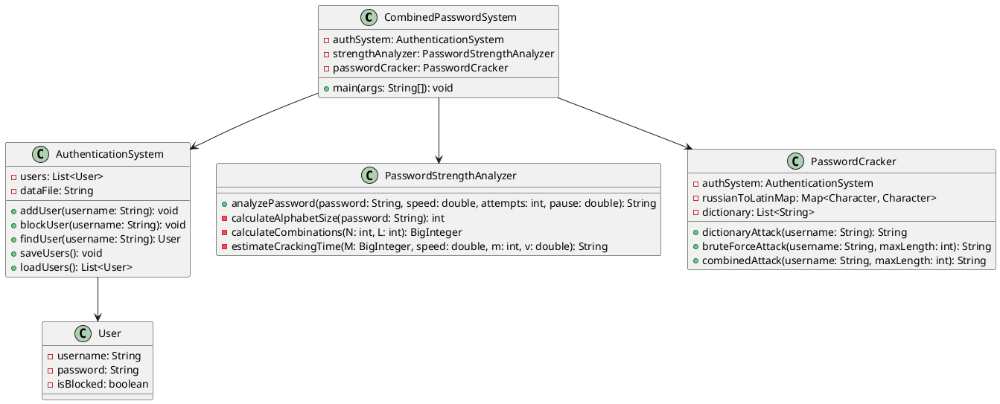
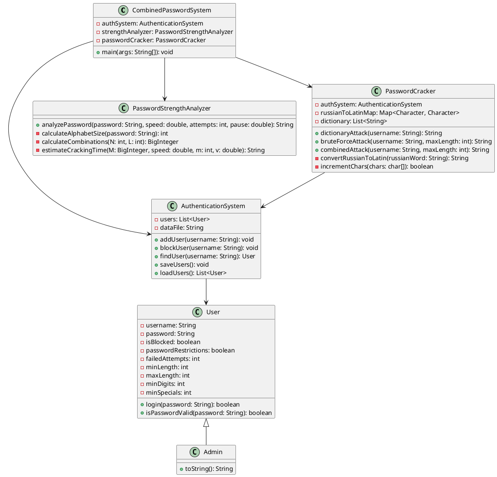
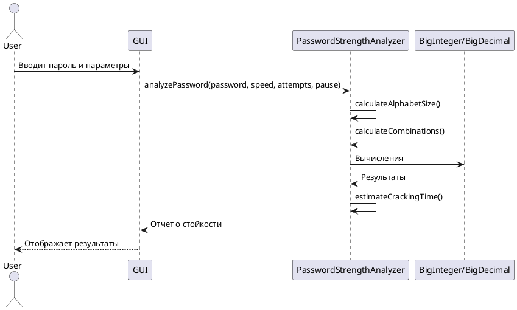
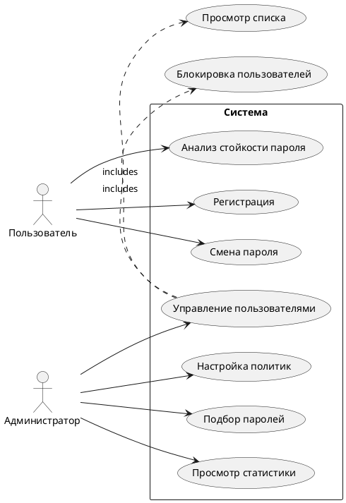
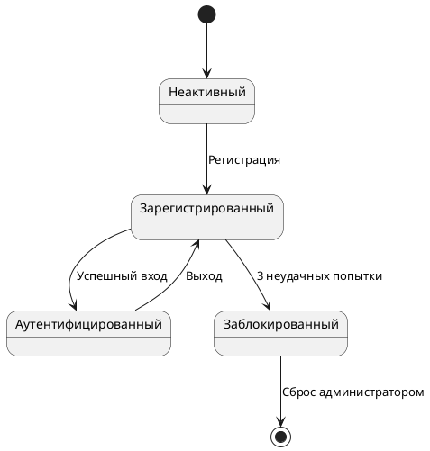
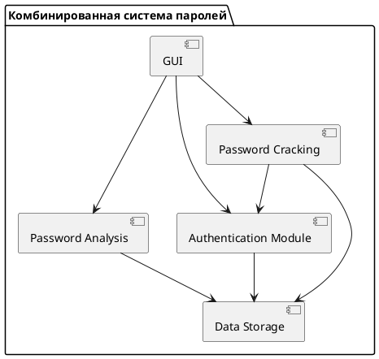

# Комбинированная система анализа и подбора паролей

## Оглавление
- [Введение](#введение)
- [Архитектура системы](#архитектура-системы)
- [Подробное описание функционала](#подробное-описание-функционала)
- [Технические аспекты реализации](#технические-аспекты-реализации)
- [Руководство пользователя](#руководство-пользователя)
- [Руководство администратора](#руководство-администратора)
- [Безопасность и ограничения](#безопасность-и-ограничения)
- [Производительность](#производительность)
- [Дополнительные возможности](#дополнительные-возможности)
- [Часто задаваемые вопросы](#часто-задаваемые-вопросы)
- [Разработка и контрибуция](#разработка-и-контрибуция)

## Введение
### Назначение системы
Комбинированная система анализа и подбора паролей представляет собой учебно-демонстрационное приложение, разработанное для:
- Демонстрации принципов криптостойкости паролей
- Анализа времени, необходимого для взлома паролей методом перебора
- Исследования эффективности различных методов подбора паролей
- Обучения основам информационной безопасности

### Основные концепции
Система реализует два режима:
1. **Аналитический режим** - оценивает стойкость пароля к атакам методом полного перебора.
2. **Практический режим** - демонстрирует методы подбора паролей на тестовой системе аутентификации.

## Архитектура системы
### Компонентная диаграмма
```
+-----------------------+
|     GUI Layer         |
| (CombinedPasswordSystem) |
+-----------------------+
           |
           v
+-----------------------+
|   Business Logic      |
| 1. AuthenticationSystem |
| 2. PasswordStrengthAnalyzer |
| 3. PasswordCracker    |
+-----------------------+
           |
           v
+-----------------------+
|   Data Layer          |
| 1. User/Admin models  |
| 2. Dictionary files   |
| 3. Configuration      |
+-----------------------+
```

## Подробное описание функционала
### Система аутентификации
- **Обычные пользователи** могут менять пароль, но подвержены ограничениям политики безопасности.
- **Администраторы** имеют полный доступ к управлению пользователями и анализу паролей.

### Парольные политики
- Минимальная/максимальная длина пароля
- Минимальное количество цифр и спецсимволов
- Обязательное использование букв разного регистра

### Анализ надежности паролей
Используется следующая формула энтропии:
```math
Энтропия = log2(N^L)
```
Где `N` - мощность алфавита, а `L` - длина пароля.

## Технические аспекты реализации
### Ключевые технологии
- **Java SE 8+** – основная платформа
- **Swing** – графический интерфейс
- **BigInteger/BigDecimal** – работа с большими числами
- **Регулярные выражения** – анализ сложности паролей

### Обработка больших чисел
```java
BigInteger M = BigInteger.valueOf(N).pow(passwordLength);
BigDecimal totalTime = new BigDecimal(M).divide(BigDecimal.valueOf(speed), 50, RoundingMode.HALF_UP);
```

## Руководство пользователя
### Типовые сценарии
#### Анализ пароля
1. Откройте вкладку "Анализ пароля".
2. Введите пароль для проверки.
3. Получите отчет о его стойкости.

#### Регистрация нового пользователя
1. Введите имя пользователя.
2. Нажмите "Зарегистрироваться".
3. Установите пароль при первом входе.

## Руководство администратора
### Настройка системы
- Минимальная длина пароля: **8+ символов**
- Максимальная длина пароля: **64 символа**
- Автоматическая блокировка после **3 неудачных попыток**

## Безопасность и ограничения
### Ограничения системы
- Учебная направленность – **не для реального использования**
- Хранение паролей в **открытом виде** (не соответствует стандартам)
- Отсутствие шифрования конфиденциальных данных

## Производительность
### Факторы влияния
- Скорость подбора паролей: **100-10000 попыток/сек**
- Эффективность словарных атак: **до 30% для простых паролей**

## Дополнительные возможности
- **Интеграция с REST API** *(в разработке)*
- **Поддержка LDAP** *(планируется)*
- **Экспорт отчетов в PDF/CSV**

## Часто задаваемые вопросы
### Как увеличить эффективность подбора паролей?
- Добавьте больше слов в словарь
- Используйте специализированные словари
- Настройте параметры перебора

### Как сбросить пароль администратора?
Удалите `users.txt` и перезапустите систему – будет создан новый администратор с пустым паролем.

## Разработка и контрибуция
### Сборка из исходников
```bash
git clone https://github.com/your-repo/your-project.git
cd your-project
mvn clean package
```

### Дорожная карта
- Базовая система аутентификации
- Анализ стойкости паролей
- Методы подбора паролей
- Ведение журнала событий
- Шифрование хранимых данных

## Лицензия
Проект распространяется под лицензией **MIT**. Полный текст доступен в файле [LICENSE](LICENSE).

## UML-диаграмма классов


## UML-диаграммы
### 1. Диаграмма классов


### 2. Диаграмма последовательностей - Анализ пароля


### 3. Диаграмма вариантов использования


### 4. Диаграмма состояний - Пользователь


### 5. Диаграмма компонентов



